# pocket_treasure
Just another Android app for my muslim brothers. You can use this app also as an MVVM example or check all used Android Architecture Components. I tried following the best practices around.

## App screenshots:

## Dark Mode

 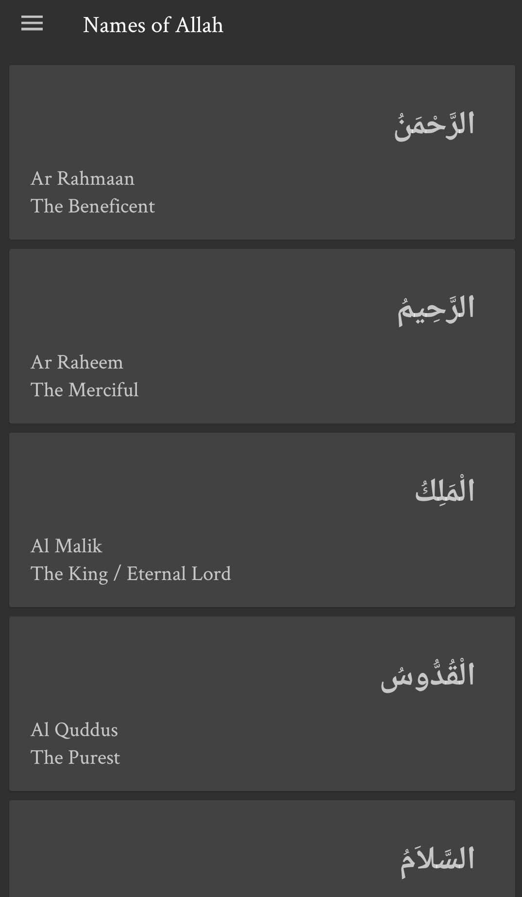
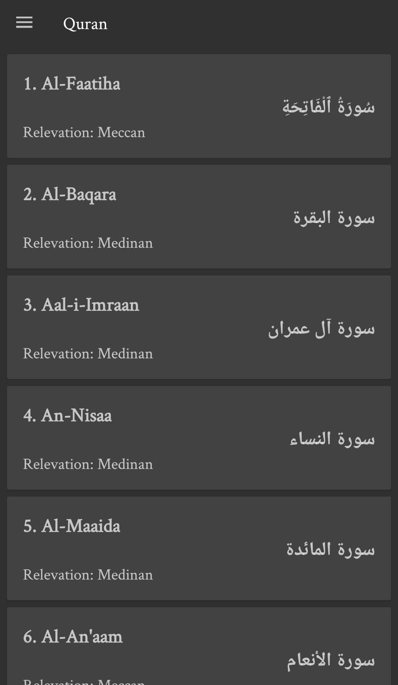
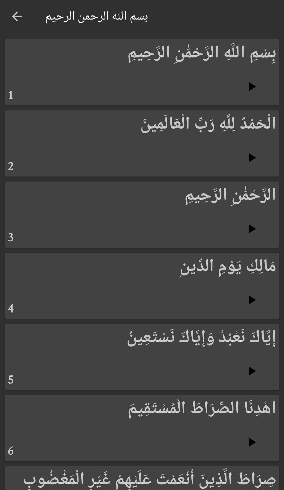
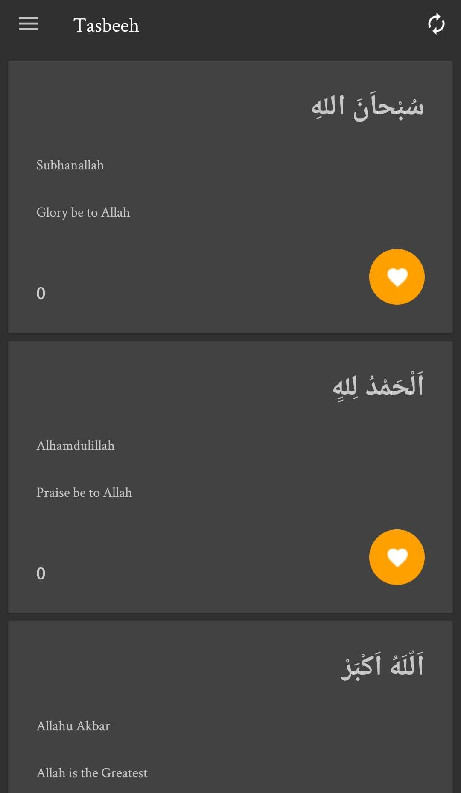
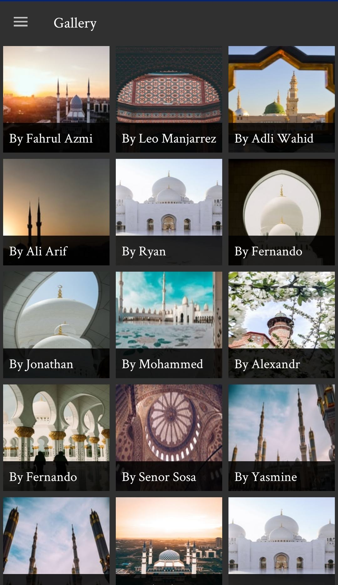
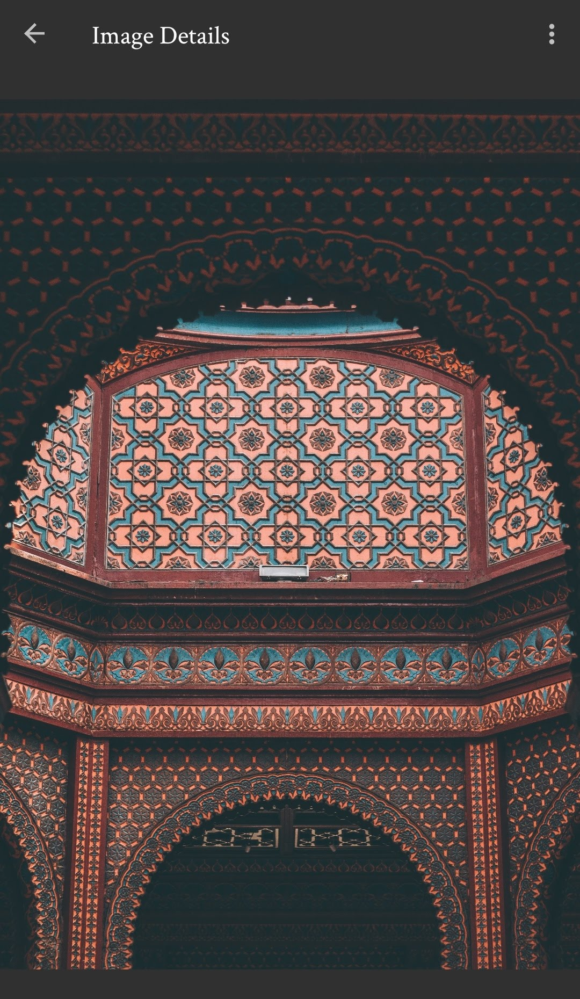
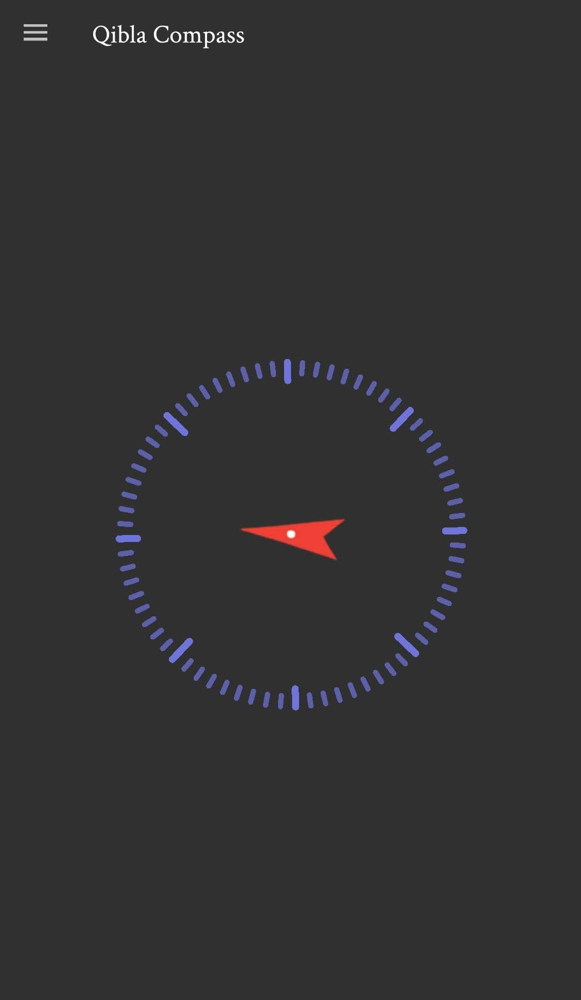
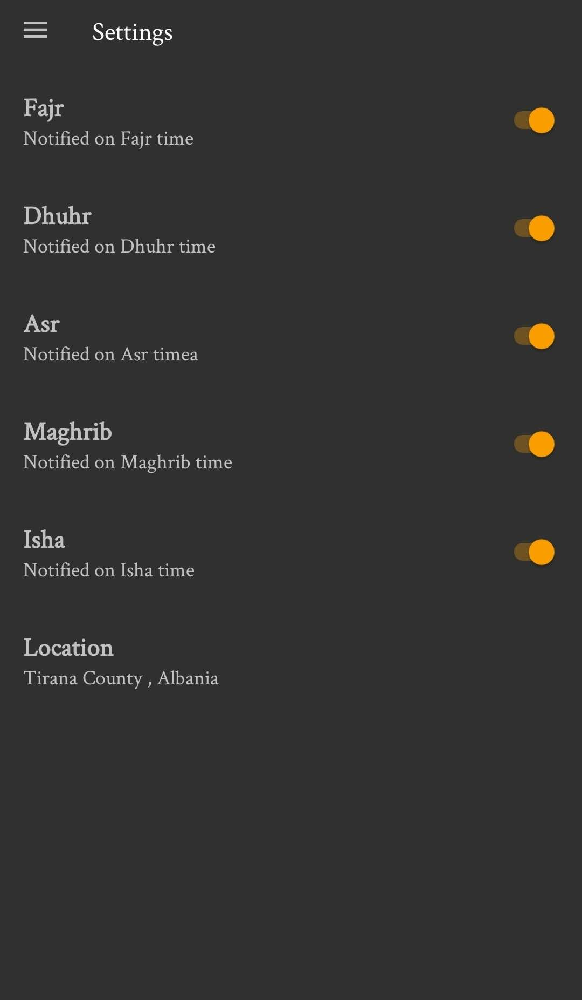

## Light mode

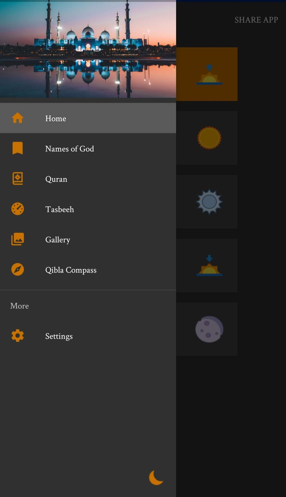 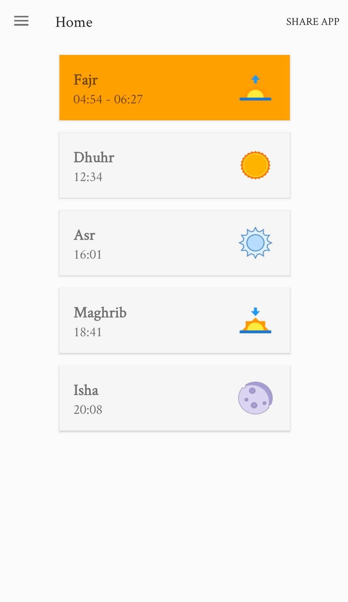
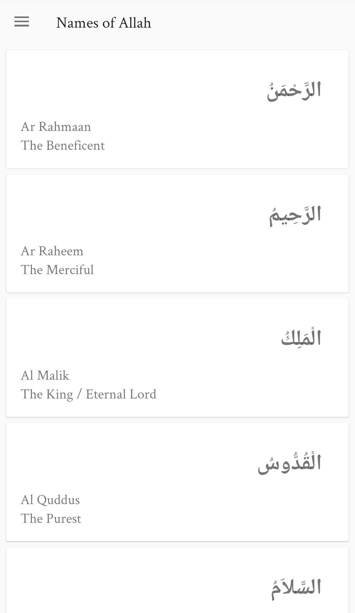
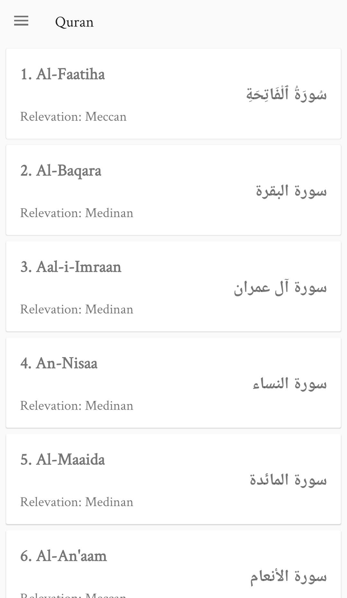
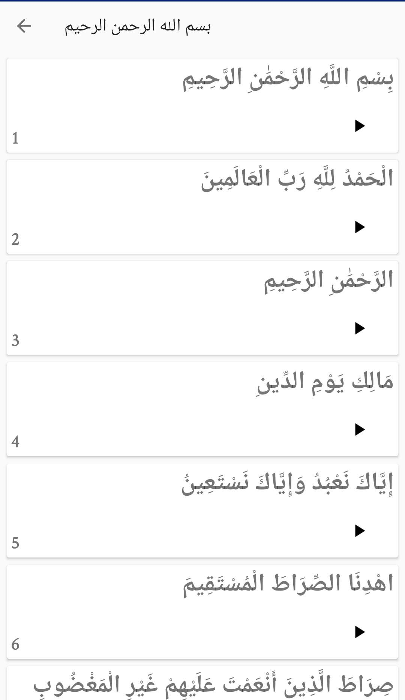
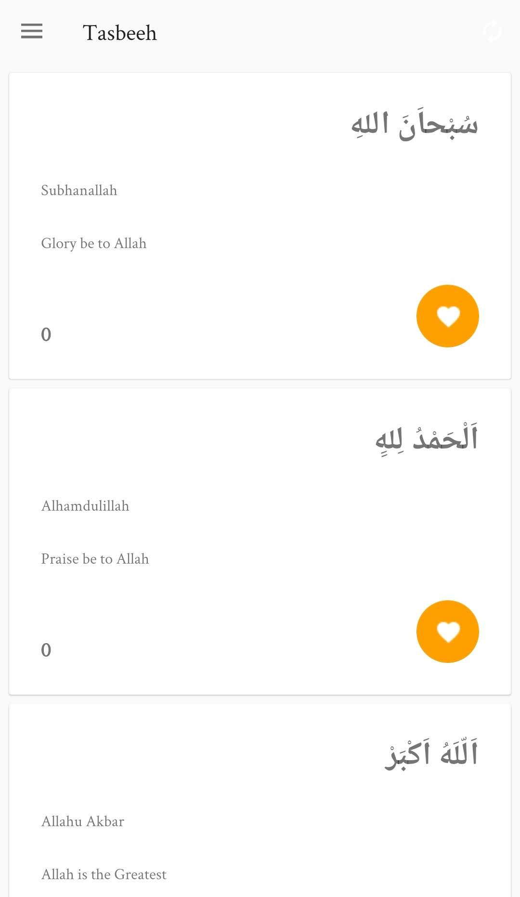
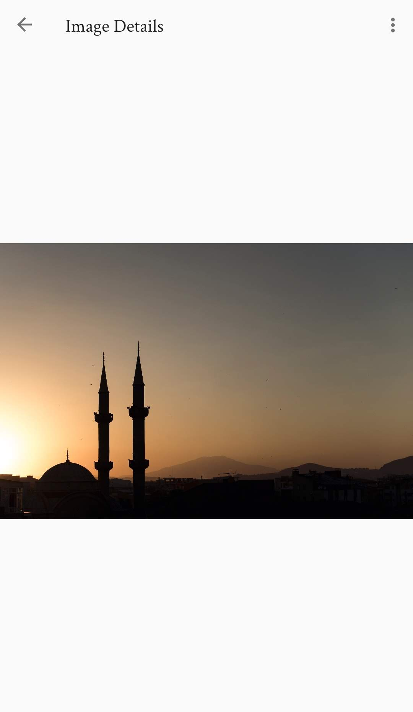
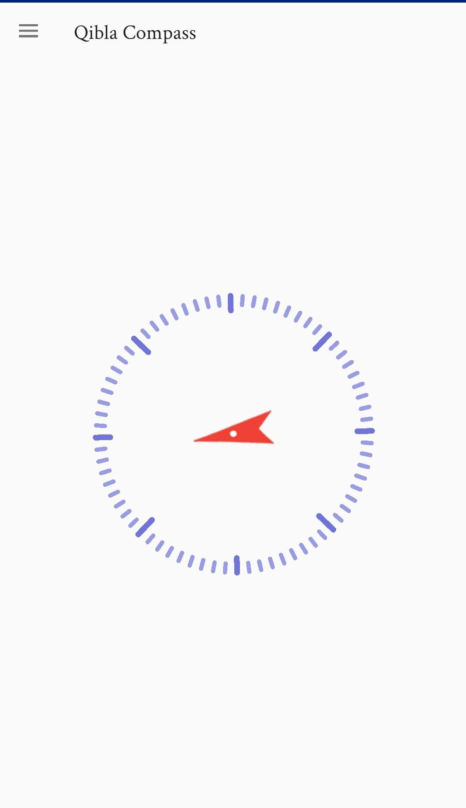
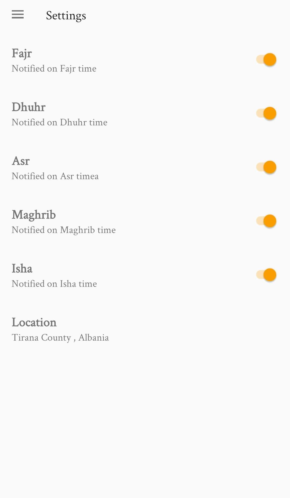
